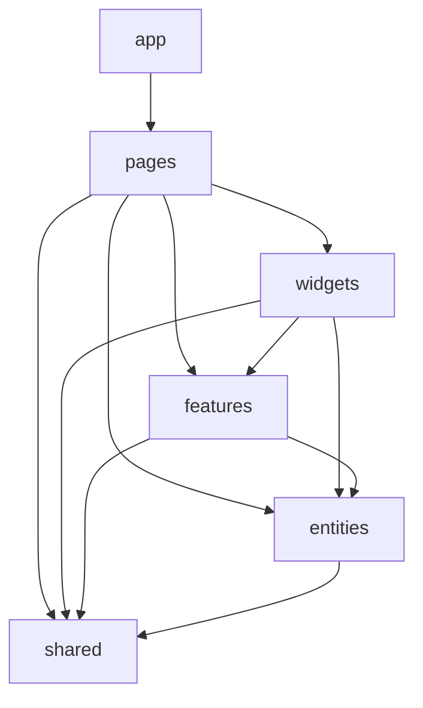

# Dashboard FSD conventions

Эта директория организована по **Feature-Sliced Design**. Перед тем как
добавлять или менять код — сверьтесь с этим документом.

## Слои (импорты строго сверху вниз)

```text
app      → pages → widgets → features → entities → shared
```



Запрещено:
- импорт «вверх» (entities не знает о features, shared не знает ни о чём
  выше);
- горизонтальные импорты внутри одного слоя (entity-A не импортит
  entity-B; feature-X не импортит feature-Y).

## Сегменты внутри слайса (одинаковы для всех слоёв)

| Сегмент   | Что лежит                                                        |
|-----------|-------------------------------------------------------------------|
| `api/`    | `req.ts` — фетчеры и react-query хуки; `res.ts` — response shapes; `types.ts` — доменные типы; `index.ts` — barrel |
| `model/`  | типы, состояние, константы, сторы                                |
| `lib/`    | чистые утилиты слайса (без React)                                |
| `ui/`     | компоненты слайса                                                 |
| `index.ts(x)` | публичный barrel слайса                                       |

## Шаблоны

### entities/&lt;name&gt;

```text
entities/<name>/
  api/{req,res,types,index}.ts
  lib/?.ts             # чистые утилиты, опционально
  index.ts             # публичный barrel
```

В entity НЕТ:
- React-компонентов с UI (только хуки);
- констант для UI-табов/шагов (это уровень page);
- зависимостей от других entities (используйте `shared/lib/*` если нужен общий примитив).

### features/&lt;verb-noun&gt;

```text
features/<action>/
  ui/index.tsx         # один компонент = одна кнопка/форма/модалка
  ui/<sub>.tsx         # для composite-features (модалка с несколькими карточками)
  model.ts             # форма, тип значений (если zod-форма)
  index.ts             # export только public-компонента
```

Правила:
- одна feature = одно действие (CRUD/мутация/триггер).
- features НЕ импортят другие features.
- features импортят `entities` + `shared`. UI-пакет `@eop/ui` — ок.
- список/таблица — это композиция, она живёт в widget или page, не в feature.

### widgets/&lt;name&gt;

```text
widgets/<name>/
  ui/{index.tsx, <sub>.tsx}
  lib/?.ts             # хуки/утилиты слайса
  model/?.ts           # mapping-таблицы и т.п.
  index.ts             # barrel
```

Widget — тонкая композиция: данные из `entities` + действия из `features`.
Не должен содержать саму бизнес-логику (мутации с confirm/toast — это feature).

### pages/&lt;name&gt;

```text
pages/<name>/
  index.tsx            # route — гард, redirect, чтение query/params, рендер <Page/>
  <name>.tsx           # page-shell — composition виджетов и features
  model/?.ts           # типы/константы (табы, шаги)
  ui/<sub>.tsx         # подкомпоненты страницы
```

Исключение для public-страниц без guard: `index.tsx` может одновременно быть
route и page (см. `pages/landing`).

## Soft конвенции

- Файлы — kebab-case (`team-detail.tsx`), компоненты — PascalCase (`TeamDetail`).
- Если в файле один публичный экспорт — имя файла = имя экспорта kebab-кейсом.
- Все модулы exports через `index.ts` barrel.
- i18n keys не меняем — только импорт-пути.
- Сторонняя библиотека форм — `react-hook-form` + zod (`shared/lib/schemas.ts`).
- Тосты — через `useMutationToast`, чтобы единый шаблон success/error.
- Auth state — единственный entry: `useAuth` из `entities/session`.
- LocalStorage `eop_*` — через `shared/lib/session-storage` (никогда напрямую).

## Когда сомневаешься

- «Куда положить X?» — **самый высокий слой, который ещё может его принять**.
  Если используется в одной странице — pages/. Если в нескольких — widgets/.
  Если кросс-фичи — features/. Если домен — entities/. Если универсальная утилита — shared/.
- «Это feature или widget?» — feature всегда содержит **действие** (мутация/форма/кнопка).
  Widget — composite UI-блок, который сам по себе ничего не меняет.
- «Можно ли horizontally импортировать?» — нет. Если очень надо общий код — поднимите в shared или нижний слой.
